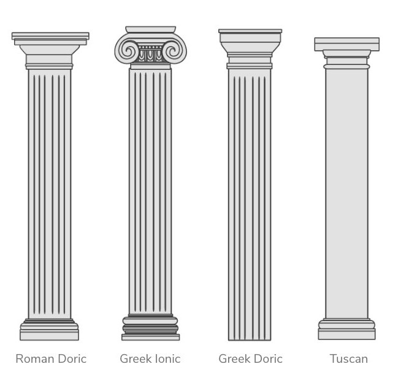

# Extra Architectural Objects
Extra Architectural Objects add-on for Blender 3.00 for generating architectural object with controllable parameters

# WARNING
This is PRE-ALPHA version of the add-on, USE IT AT YOUR OWN RISK! The author of this program assumes no responsibility for any issues caused by the use of this add-on, in any way. It hasn't been tested much, it may currently work pretty slow and it may be strongly modified in the future.
# INSTALL
* download zip-file (don't unpack)
* Open Blender
* Edit > Preferences > Add-ons > Install >
* Specify the path to the zip file on your computer
* Press Install Add-on button
* Enable Chekbox near its name
# Type Column

# Column Parametrs
> ***segments*** : Number of segments for the ring of the column

> ***radius*** : Length the radius from the circle to the center of the cross sections

> ***width*** : The height of the column associated with the radius

> ***fill_type*** : Cap fill type 
* **Nothing** : Dont fill at all
* **N-Gon** : Use n-gons
* **Triangle Fan** : Use triangle fans
> **Align** : Align the new object
* **World** : Align the new object to the world
* **View** : Align the new object to the view
* **3D Cursor** : Use 3D orientation for the new object
> **Location** : Location the new object in matrix
* **X** : Scala X
* **Y** : Scala Y
* **Z** : Scala Z
> **Rotation** : Rotation the new object in matrix
* **X** : Scala X
* **Y** : Scala Y
* **Z** : Scala Z
# Type Pedestal

# Pedestal Parametrs
